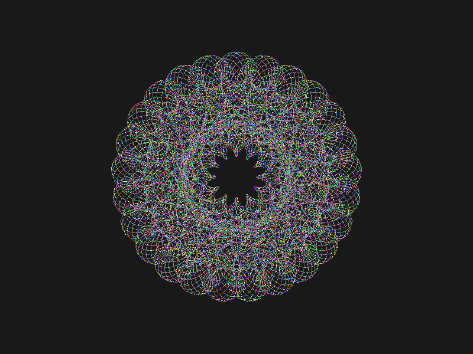

# SpiroGreg
<div align="center">
  
  <p>example exported screenshot<p>
</div>

### 📖 Description
SpiroGreg is a spirograph-like drawing program that allows you to attach several arms that rotate in a circle end to end. Each arm has a different user-definable length and angular velocity, and the outside edge of the final arm draws it's path onto the screen. The end result is a spirograph-like pattern, which you can augment with different color schemes or take screenshots of. This should also give some intuition into how Fourier Theorem (https://www.mtsu.edu/faculty/wroberts/teaching/fourier_4.php) works if you've taken Differential Equations in school, i.e. how complex patterns can arise out of simple periodic waveforms.

SpiroGreg is an app I made years ago before I learned git, while learning SFML and C++. It was originally created using SFML 2.4, but I have updated it to use the latest version. I will also be making improvements to both code cleanliness (not great currently) and user friendliness. 

### 🛠 Technologies Used
- C++
- SFML 2.6

### ⚙️ Setup/Installation Requirements
Detailed (but Visual Studio specific) instructions coming soon... 

### 🖥️ Usage
- Follow installation instructions above, then run the program, a command line will appear
- Add the number of "arm" segments you would like to add to your drawing machine, hit enter
- Add the length and speed for each arm, hit enter
- Choose a color pattern, hit enter
- The animation will start playing. You may press certain keys on your keyboard to get actions to happen. Commands listed below.

### ⌨️ Runtime Keyboard Controls
L key — makes drawing machine arms invisible   \
P key — takes a photo of your pattern in its current state   \
B key — changes background color (caution, some settings contain flashing colors!)   \
Down Arrow  — allows you to cycle between color patterns in the middle of animation   \
Esc — close window   \

### 🦠 Known Bugs OR Issues
- "secondsToRepeat" seems to be calculated incorrectly, and should have a different name when displayed to the user
- When taking a screen shot, often the drawing will freeze and then create an erroneous solid line once drawing resumes
- The inputs for each arm should come from a UI, not command line
- User should be able to restart a new drawing without restarting the program

### ⚖️ License
[MIT](https://opensource.org/licenses/MIT)    

```
MIT License
Permission is hereby granted, free of charge, to any person obtaining a copy
of this software and associated documentation files (the "Software"), to deal
in the Software without restriction, including without limitation the rights
to use, copy, modify, merge, publish, distribute, sublicense, and/or sell
copies of the Software, and to permit persons to whom the Software is
furnished to do so, subject to the following conditions:
The above copyright notice and this permission notice shall be included in all
copies or substantial portions of the Software.
THE SOFTWARE IS PROVIDED "AS IS", WITHOUT WARRANTY OF ANY KIND, EXPRESS OR
IMPLIED, INCLUDING BUT NOT LIMITED TO THE WARRANTIES OF MERCHANTABILITY,
FITNESS FOR A PARTICULAR PURPOSE AND NONINFRINGEMENT. IN NO EVENT SHALL THE
AUTHORS OR COPYRIGHT HOLDERS BE LIABLE FOR ANY CLAIM, DAMAGES OR OTHER
LIABILITY, WHETHER IN AN ACTION OF CONTRACT, TORT OR OTHERWISE, ARISING FROM,
OUT OF OR IN CONNECTION WITH THE SOFTWARE OR THE USE OR OTHER DEALINGS IN THE
SOFTWARE.
```
If you have any issues or questions or comments 
contact me at briefcasemanx@gmail.com.    
Copyright (c) _2023_  _Eric Crudup_

<center><a href="#">Return to Top</a></center>
